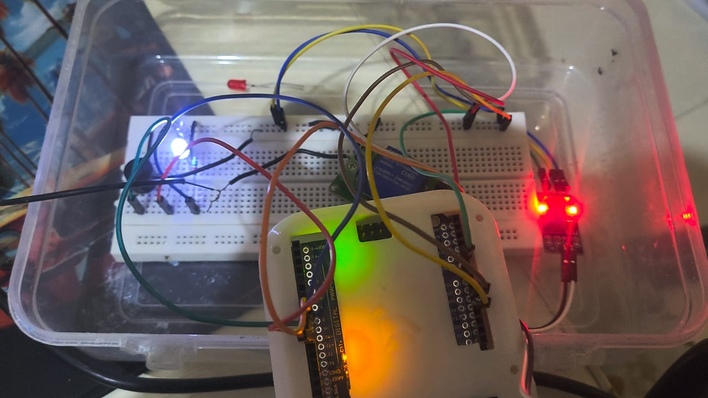

# 🌱 Automatic Plant Watering System

<p align="center">
  
</p>

## 📌 Overview

The **Automatic Plant Watering System** is an embedded system project that automates irrigation using a soil moisture sensor and Arduino. It continuously monitors soil conditions and activates a water pump only when the soil becomes dry, ensuring efficient water usage and healthy plant growth.

---

## 🎯 Objectives

* Automate plant watering process
* Reduce manual effort
* Conserve water by watering only when needed
* Provide real-time feedback using LEDs and buzzer

---

## ⚙️ Components Used

* Arduino Uno (ATmega328P)
* Soil Moisture Sensor (YL-38 with YL-69 probe)
* 5V Relay Module
* Mini Submersible Water Pump (5V DC)
* LEDs (Red, White/Green)
* 1kΩ Resistors
* Active Buzzer
* Breadboard
* Jumper Wires
* Tubing Pipe

---

## 🔌 Circuit Description

* Soil moisture sensor → **A0**
* Relay module → **Digital Pin 7**
* Red LED → **Pin 8**
* Buzzer → **Pin 9**
* White/Green LED → **Pin 10**
* Pump controlled through relay

---

## 🔁 Working Principle

1. The soil moisture sensor reads the moisture level.
2. Arduino processes the analog value.
3. Value is compared with a threshold.
4. If soil is dry:

   * Pump turns ON
   * Red LED turns ON
   * Buzzer activates
5. If soil is wet:

   * Pump turns OFF
   * White/Green LED turns ON
   * Buzzer turns OFF

---

## 💻 Code Logic

* Uses `analogRead()` for sensor input
* Threshold-based decision making
* Controls relay, LEDs, and buzzer using digital pins
* Continuous monitoring using `loop()`

---

## 🚀 Features

* Fully automated irrigation system
* Low cost and easy to implement
* Real-time monitoring
* Energy efficient
* Suitable for home and small-scale use

---

## 📊 Applications

* Smart home gardening
* Greenhouse automation
* Indoor and office plants
* Educational embedded system projects

---

## ⚠️ Limitations

* Suitable for small-scale systems
* Requires calibration for different soil types
* No remote monitoring

---

## 🔮 Future Improvements

* IoT integration (mobile app control)
* Wi-Fi/Bluetooth connectivity
* Solar-powered system
* Water level monitoring

---

## 📷 Additional Images (Optional)

```md


```

---

## 📄 Project Report

The detailed project report is included in this repository.

---

## 🧾 Conclusion

This project demonstrates how embedded systems can automate real-world tasks efficiently. By integrating sensors, actuators, and a microcontroller, the system ensures optimal watering conditions without human intervention.
